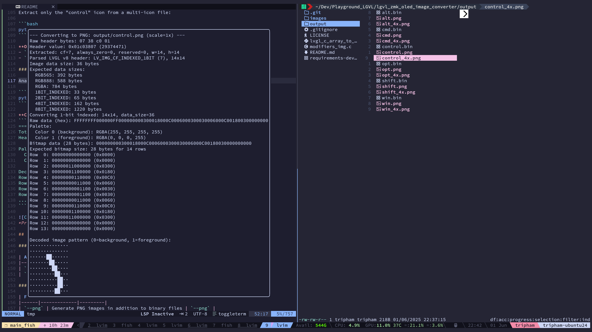
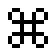

# lgvl_zmk_oled_image_converter
LVGL C Array to Binary/PNG Converter (For ZMK OLED images)

A comprehensive Python tool for converting LVGL (Light and Versatile Graphics Library) C array files to binary format and PNG images. This tool is fully compatible with the [icu tool](https://github.com/W-Mai/icu) output format and supports all major LVGL color formats.


*Converting ZMK modifier icons from C arrays to PNG images*

## Features

- ✅ **Universal Format Support**: 1-bit, 2-bit, 4-bit, 8-bit indexed, RGB565, RGB888, RGBA
- ✅ **Multiple Input Types**: Single C files, directories, existing binary files
- ✅ **PNG Generation**: Optional high-quality PNG output with scaling
- ✅ **Icon Extraction**: Extract specific icons by name from multi-icon files
- ✅ **Binary Analysis**: Detailed analysis of existing LVGL binary files
- ✅ **ZMK Compatible**: Perfect for ZMK modifier icons and keyboard displays
- ✅ **icu Tool Compatible**: Produces identical output to the icu tool

## Installation

### Prerequisites

- Python 3.7 or higher
- pip package manager

### Required Dependencies

```bash
pip install numpy pillow
```

### Installation Steps

1. **Clone the repository:**
   ```bash
   git clone https://github.com/techcaotri/lgvl_zmk_oled_image_converter.git
   cd lgvl_zmk_oled_image_converter
   ```

2. **Install dependencies:**
   ```bash
   pip install -r requirements.txt
   ```

3. **Make the script executable (optional):**
   ```bash
   chmod +x lvgl_c_array_to_bin_and_image.py
   ```

## Quick Start

### Basic Usage

```bash
# Convert a single C file to binary and PNG
python lgvl_zmk_oled_image_converter.py lgvl_zmk_oled_image_converter.c output/ --png

# Analyze an existing binary file
python lvgl_c_array_to_bin_and_image.py file.bin output/ --analyze --png

# Convert all C files in a directory
python lvgl_c_array_to_bin_and_image.py input_folder/ output/ --png
```

## Usage Examples

### Example 1: ZMK Modifier Icons

Convert ZMK modifier symbols (multiple icons in one file):

```bash
python lvgl_c_array_to_bin_and_image.py modifiers_sym.c output/ --png
```

**Input:** `modifiers_sym.c` containing multiple 14×14 1-bit indexed icons
**Output:**
- `output/control.bin` - LVGL binary format
- `output/control.png` - 14×14 PNG image
- `output/alt.bin` - LVGL binary format  
- `output/alt.png` - 14×14 PNG image
- ... (all icons in the file)


*ZMK modifier icons: Ctrl, Alt, Shift, Cmd symbols*

### Example 2: SquareLine Studio Icons

Convert SquareLine Studio exported true color icons:

```bash
python lvgl_c_array_to_bin_and_image.py chronos_sms_icon.c output/ --png
```

**Input:** `chronos_sms_icon.c` containing a single RGB565/RGB888 icon
**Output:**
- `output/chronos_sms_icon.bin` - LVGL binary format
- `output/chronos_sms_icon.png` - High-quality PNG image


*SquareLine Studio exported SMS icon in full color*

### Example 3: Extract Specific Icon

Extract only the "control" icon from a multi-icon file:

```bash
python lvgl_c_array_to_bin_and_image.py modifiers_sym.c output/ --icon control --png
```

**Output:**
- `output/control.bin` - Only the control symbol
- `output/control.png` - PNG of the control symbol

### Example 4: Analyze Binary Files

Analyze existing LVGL binary files with detailed structure breakdown:

```bash
python lvgl_c_array_to_bin_and_image.py cmd.bin output/ --analyze --png
```

**Console Output:**
```
=== DETAILED ANALYSIS OF cmd.bin ===
Total file size: 40 bytes
Full hex dump: 0738C001FFFFFFFF000000FF000000001860249024901FE0048004801FE024902490186000000000

Header (bytes 0-3): 0738C001
Header value: 0x01C03807
Parsed: format=7, width=14, height=14

Data section (36 bytes):
Bytes  4- 7: FFFFFFFF = 0xFFFFFFFF
Bytes  8-11: 000000FF = 0xFF000000
Bytes 12-15: 00000000 = 0x00000000
Bytes 16-19: 18602490 = 0x90246018
Bytes 20-23: 24901FE0 = 0xE01F9024
Bytes 24-27: 04800480 = 0x80048004
Bytes 28-31: 1FE02490 = 0x9024E01F
Bytes 32-35: 24901860 = 0x60189024
Bytes 36-39: 00000000 = 0x00000000

=== 1-BIT INDEXED ANALYSIS ===
Expected bitmap: 196 bits = 25 bytes

--- 8-byte palette + 28-byte bitmap ---
Palette data: FFFFFFFF000000FF
Bitmap data: 000000001860249024901FE0048004801FE024902490186000000000
Colors: ['#FFFFFF (A=255)', '#000000 (A=255)']

--- 12-byte palette + 24-byte bitmap ---
Palette data: FFFFFFFF000000FF00000000
Bitmap data: 1860249024901FE0048004801FE024902490186000000000
Colors: ['#FFFFFF (A=255)', '#000000 (A=255)', '#000000 (A=0)']

--- No palette, all bitmap ---
Raw bitmap: FFFFFFFF000000FF000000001860249024901FE0048004801FE024902490186000000000

--- Converting to PNG: output/cmd_standard.png (scale=1x) ---
Raw header bytes: 07 38 c0 01
Header value: 0x01c03807 (29374471)
Extracted: cf=7, always_zero=0, reserved=0, w=14, h=14
Parsed LVGL v8 header: LV_IMG_CF_INDEXED_1BIT (7), 14x14
Image data size: 36 bytes
Expected data sizes:
  RGB565: 392 bytes
  RGB888: 588 bytes
  RGBA: 784 bytes
  1BIT_INDEXED: 33 bytes
  2BIT_INDEXED: 65 bytes
  4BIT_INDEXED: 162 bytes
  8BIT_INDEXED: 1220 bytes
Converting 1-bit indexed: 14x14, data_size=36
Raw data (hex): FFFFFFFF000000FF000000001860249024901FE0048004801FE024902490186000000000
Palette:
  Color 0 (background): RGBA(255, 255, 255, 255)
  Color 1 (foreground): RGBA(0, 0, 0, 255)
Bitmap data (28 bytes): 000000001860249024901FE0048004801FE024902490186000000000
Expected bitmap size: 28 bytes for 14 rows
Row  0: 00000000000000 (0x0000)
Row  1: 00000000000000 (0x0000)
Row  2: 00011000011000 (0x1860)
Row  3: 00100100100100 (0x2490)
Row  4: 00100100100100 (0x2490)
Row  5: 00011111111000 (0x1FE0)
Row  6: 00000100100000 (0x0480)
Row  7: 00000100100000 (0x0480)
Row  8: 00011111111000 (0x1FE0)
Row  9: 00100100100100 (0x2490)
Row 10: 00100100100100 (0x2490)
Row 11: 00011000011000 (0x1860)
Row 12: 00000000000000 (0x0000)
Row 13: 00000000000000 (0x0000)

Decoded image pattern (0=background, 1=foreground):
··············
··············
···██····██···
··█··█··█··█··
··█··█··█··█··
···████████···
·····█··█·····
·····█··█·····
···████████···
··█··█··█··█··
··█··█··█··█··
···██····██···
··············
··············
Saved PNG: output/cmd_standard.png

...
```


*Properly decoded ⌘ (command) symbol from binary file*

## Command Line Options

### Required Arguments

| Argument | Description | Example |
|----------|-------------|---------|
| `source` | Input C file, directory, or binary file | `input.c`, `icons/`, `file.bin` |
| `target` | Output directory for generated files | `output/`, `build/bin/` |

### Optional Flags

| Flag | Description | Example |
|------|-------------|---------|
| `--png` | Generate PNG images in addition to binary files | `--png` |
| `--analyze` | Analyze input as existing LVGL binary file | `--analyze` |
| `--icon NAME` | Extract only the specified icon from multi-icon files | `--icon control` |

### Detailed Option Descriptions

#### `--png` Flag

Generates PNG images alongside binary files. Features:
- **Automatic scaling**: Creates both 1× and 4× scaled versions for better visibility
- **Format preservation**: Maintains original color depth and transparency
- **High quality**: Uses nearest-neighbor scaling to preserve pixel-perfect details

```bash
# Creates both .bin and .png files
python lvgl_c_array_to_bin_and_image.py input.c output/ --png
```

#### `--analyze` Flag

Provides detailed analysis of binary files:
- **Header parsing**: Decodes LVGL format, width, height
- **Structure breakdown**: Shows palette, bitmap data layout  
- **Hex dump**: Complete file structure visualization
- **Format detection**: Automatically identifies color format
- **Validation**: Compares against expected data sizes

```bash
# Analyze existing binary file
python lvgl_c_array_to_bin_and_image.py mysterious.bin output/ --analyze --png
```

#### `--icon` Option

Extracts specific icons from multi-icon C files:
- **Name matching**: Finds icon by variable name
- **Single output**: Creates only the requested icon
- **Efficient**: Doesn't process unwanted icons

```bash
# Extract only the shift icon
python lvgl_c_array_to_bin_and_image.py modifiers.c output/ --icon shift --png
```

## File Format Support

### Input Formats

| Format | Description | Example Use Case |
|--------|-------------|------------------|
| **C Array Files** | LVGL C source files with `lv_img_dsc_t` structures | ZMK icons, SquareLine exports |
| **Binary Files** | Existing LVGL binary format files | Pre-converted assets, firmware images |
| **Directories** | Folders containing multiple C files | Batch processing icon sets |

### Output Formats

#### Binary Files (.bin)
- **LVGL v8 compatible** binary format
- **Identical to icu tool** output
- **Direct firmware use** - can be embedded in applications
- **Compact size** - optimized for embedded systems

#### PNG Images (.png)
- **RGBA format** with proper transparency
- **Multiple scales** - 1× for accuracy, 4× for visibility  
- **Pixel-perfect** representation of original data
- **Compatible** with all image viewers and editors

### Supported Color Formats

| LVGL Format | Bits/Pixel | Description | Use Case |
|-------------|------------|-------------|-----------|
| `LV_IMG_CF_INDEXED_1BIT` | 1 | 2-color indexed | Icons, symbols, simple graphics |
| `LV_IMG_CF_INDEXED_2BIT` | 2 | 4-color indexed | Simple icons with shading |
| `LV_IMG_CF_INDEXED_4BIT` | 4 | 16-color indexed | Retro-style graphics |
| `LV_IMG_CF_INDEXED_8BIT` | 8 | 256-color indexed | Complex indexed images |
| `LV_IMG_CF_TRUE_COLOR` | 16/24 | RGB565/RGB888 | Full-color images |
| `LV_IMG_CF_TRUE_COLOR_ALPHA` | 32 | RGBA | Full-color with transparency |

## Advanced Usage

### Batch Processing

Process entire directories of icon files:

```bash
# Convert all C files in icons/ directory
python lvgl_c_array_to_bin_and_image.py icons/ output/ --png

# Analyze all binary files
for file in *.bin; do
    python lvgl_c_array_to_bin_and_image.py "$file" analysis/ --analyze --png
done
```

### Integration with Build Systems

#### Makefile Integration

```makefile
# Convert all icon sources to binary format
icons: $(wildcard src/icons/*.c)
	python tools/lvgl_c_array_to_bin_and_image.py src/icons/ build/icons/ --png

# Analyze binary assets
analyze-assets:
	python tools/lvgl_c_array_to_bin_and_image.py assets/ analysis/ --analyze --png
```

#### CMake Integration

```cmake
# Custom command to convert LVGL icons
add_custom_command(
    OUTPUT ${CMAKE_BINARY_DIR}/icons/
    COMMAND python ${CMAKE_SOURCE_DIR}/tools/lvgl_c_array_to_bin_and_image.py 
            ${CMAKE_SOURCE_DIR}/src/icons/ 
            ${CMAKE_BINARY_DIR}/icons/ --png
    DEPENDS ${ICON_SOURCES}
)
```

## Troubleshooting

### Common Issues

#### "Invalid LVGL header" Error

**Problem:** Binary file analysis fails
**Solution:** 
- Verify file is actual LVGL binary format
- Check file isn't corrupted or truncated
- Use `--png` flag to attempt PNG generation anyway

```bash
# Force conversion attempt
python lvgl_c_array_to_bin_and_image.py problem.bin output/ --analyze --png
```

#### "Not enough data" Warnings

**Problem:** File size doesn't match expected format
**Solution:**
- File may use different color format than detected
- Try analyzing with detailed output to see structure

#### PNG Images Look Wrong

**Problem:** Generated PNG doesn't match expected appearance
**Solution:**
- Use `--analyze` flag to see detailed decoding process
- Check if palette colors are inverted
- Verify bit ordering in console output

### Debug Mode

For detailed debugging, the script provides extensive console output:

```bash
# Maximum verbosity
python lvgl_c_array_to_bin_and_image.py input.c output/ --png --analyze
```

This shows:
- File parsing steps
- Header decoding details  
- Palette color extraction
- Bit-by-bit pixel decoding
- Format detection logic

## Contributing

1. **Fork the repository**
2. **Create a feature branch**: `git checkout -b feature/amazing-feature`
3. **Commit changes**: `git commit -m 'Add amazing feature'`
4. **Push to branch**: `git push origin feature/amazing-feature`
5. **Open a Pull Request**

### Development Setup

```bash
# Clone your fork
git clone https://github.com/techcaotri/lgvl_zmk_oled_image_converter.git
cd lgvl_zmk_oled_image_converter

# Install development dependencies
pip install -r requirements-dev.txt

```

## License

This project is licensed under the Apache License - see the [LICENSE](LICENSE) file for details.

## Acknowledgments

- **LVGL Team** - For the amazing graphics library
- **ZMK Community** - For inspiration and icon format standards
- **icu Tool** - For format compatibility reference

## Related Projects

- [LVGL](https://github.com/lvgl/lvgl) - Light and Versatile Graphics Library
- [icu](https://github.com/W-Mai/icu) - Image Converter Utility for LVGL
- [ZMK](https://github.com/zmkfirmware/zmk) - Zephyr Mechanical Keyboard Firmware

---

**Made with ❤️ for the embedded graphics community**

